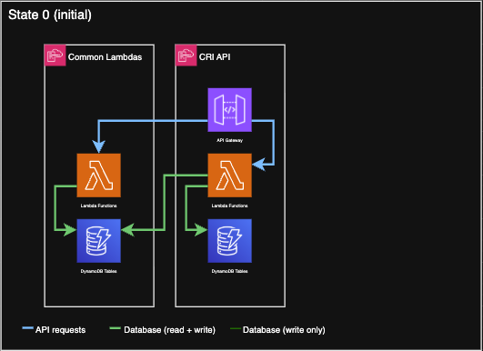
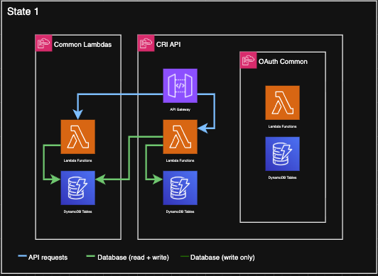
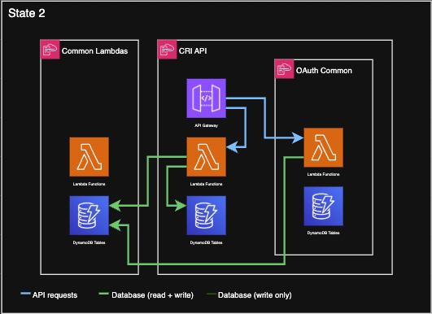

# Migrating from CommonLambdas

## Overview

This document covers how to migrate an existing CRI using CommonLambdas, to using OAuthCommon. 

We have split the migration into 2 phases, a lambda migration and a database migration.

For more information on why this approach was chosen, see the [Migration Spike](https://govukverify.atlassian.net/wiki/x/HYDkiwE)

## Phase 1 - Lambda Migration

### Aim

The aim of Phase 1 is to migrate from the CommonLambdas Lambda functions to the OAuthCommon Lambda functions. To minimise change during this phase, the new OAuthCommon Lambda functions will be configured to use the existing CommonLambdas database tables before transitioning to their own tables in Phase 2.

This phase will migrate from State 0 (the current implementation), through State 1, and ultimately to State 2, as illustrated below. These states will be referenced throughout this document to describe the progression of the migration.

<table align="center">
  <tr>
    <th>State 0</th>
    <th>State 1</th>
    <th>State 2</th>
  </tr>
  <tr>
    <td></td>
    <td></td>
    <td></td>
  </tr>
</table>

### Step 1 - Deploy latest CommonLambdas

Ensure the latest CommonLambdas code is deployed to all the CRIs accounts.

### Step 2 - Deploy OAuthCommon to all environments

Update pipelines and GHA's to be compatible with SAR, then deploy OAuthCommon to all enviroments.

1. Update the CRI's pipeline to work with SAR applications. This includes updating the deploy-pipeline and adding the signing profile. As this is completed in a private repo, please find the example PR from this [jira ticket](https://govukverify.atlassian.net/browse/OJ-3752). 
2. Deploy the OAuthCommon resource upto Staging, example [PR](https://github.com/govuk-one-login/ipv-cri-check-hmrc-api/pull/783)
    - Update the CRI preview build and deploy actions to `4c76410195b5fcb1804fc7c183ed20704252830f` or more recent.
    - Add OAuthCommon resource with all the required CF parameters, some of these will need deriving from CommonLambdas. Use the latest version of OAuthCommon.
    - Ensure you also pass in `CommonLambdasStackName: !Ref CommonStackName` and if required (Orange CRIs) `CommonLambdasUsesCMK: true` to OAuthCommon. This ensures the IAM policies will be added to the lambdas for the CommonLambda tables before we start to use them.
    - Add `CAPABILITY_AUTO_EXPAND` to `deploy.sh`
3. Deploy the OAuthCommon resource in all enviroments.

This now gets us to State 1. 

### Step 3 - Update monitoring dashboard

Now the OAuthCommon lambda resources exist in each account, add the lambdas to your monitoring dashboard: [Dynatrace example](https://github.com/govuk-one-login/observability-configuration/pull/667)

### Step 4 - Add APIGW mappings to point to OAuthCommon

An example PR for this can be found [here](https://github.com/govuk-one-login/ipv-cri-check-hmrc-api/pull/786)

Add the conditions `UseOAuthCommonLambdas` & `UseOAuthCommonTables` with environment mappings. `UseOAuthCommonLambdas` will need conditionally wrapping around the APIGW uri, alarms using the function names, and some lambda env vars (to support moving from CommonLambdas SSM params to OAuth outputs).

Note: The example PR also adds OAuthCommon table policies to the CRI lambdas. Although the production table migration will be more complex than setting `UseOAuthCommonTables`, it is still useful to have this functional in lower envs.

At this step we only want to test this locally. Keep both `UseOAuthCommonLambdas` & `UseOAuthCommonTables` set to `false` in all environments. This ensures any added mappings still work all the way to prod when false.

### Step 5 - Enable UseOAuthCommonLambdas

Set `UseOAuthCommonLambdas` to `true` in dev (and localdev). This should now be using the OAuthCommon lambdas in combination with the CommonLambda tables. This is State 2 in the diagrams (in dev only)

Add to the CRI's existing integration tests to ensure the correct database is being written to, an example is [here](https://github.com/govuk-one-login/ipv-cri-check-hmrc-api/pull/788/changes#diff-3f1903902547fd1cfb717420eef2dd0d045d6e5fbd56cd5d01c85c4bfd412c66).

### Step 6 - Enable UseOAuthCommonLambdas in build

Set `UseOAuthCommonLambdas` to `true` in build.

It is advised to run traffic (perf test script) through the CRI in build while this change is being deployed to test there are no errors during a migration. Guidance on running perf tests scripts can be found [here](https://govukverify.atlassian.net/wiki/spaces/OJ/pages/4914479159/Run+Perf+tests+on+a+CRI)

### Step 7 - Enable UseOAuthCommonLambdas in staging

Set `UseOAuthCommonLambdas` to `true` staging. This will now integrate with Core, so leave some time to ensure there are no errors. 

### Step 8 - Enable UseOAuthCommonLambdas in integration and production

Set `UseOAuthCommonLambdas` to `true` in integration and production.

### Step 9 - Remove CommonLambdas lambdas from CRI monitoring dashboard 

Now the OAuthCommon lambdas are being used in all environments, we no longer need to monitor the CommonLambdas lambdas.

---

## Phase 2 - Table migration

TBC - A general overview can be found in the [Migration Spike](https://govukverify.atlassian.net/wiki/x/HYDkiwE)
